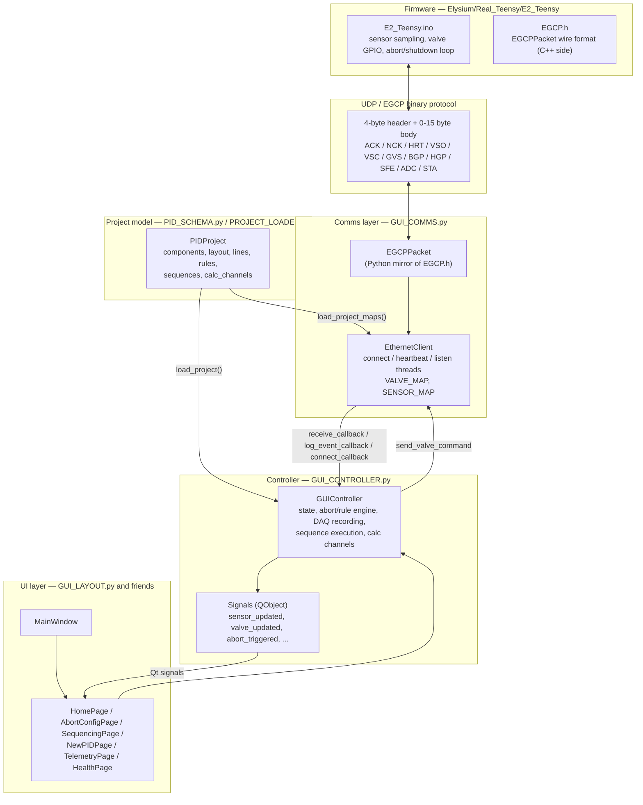
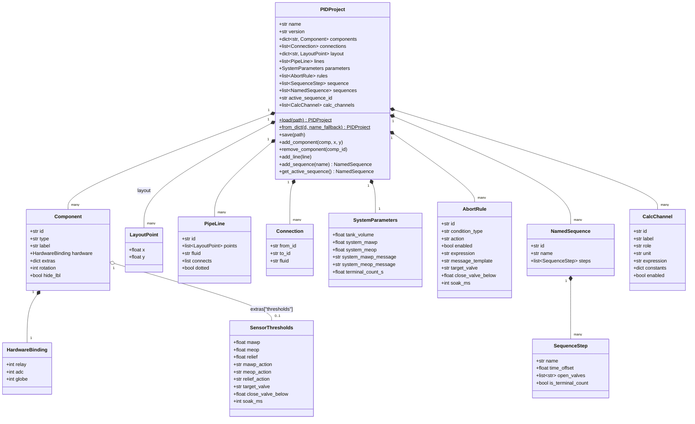
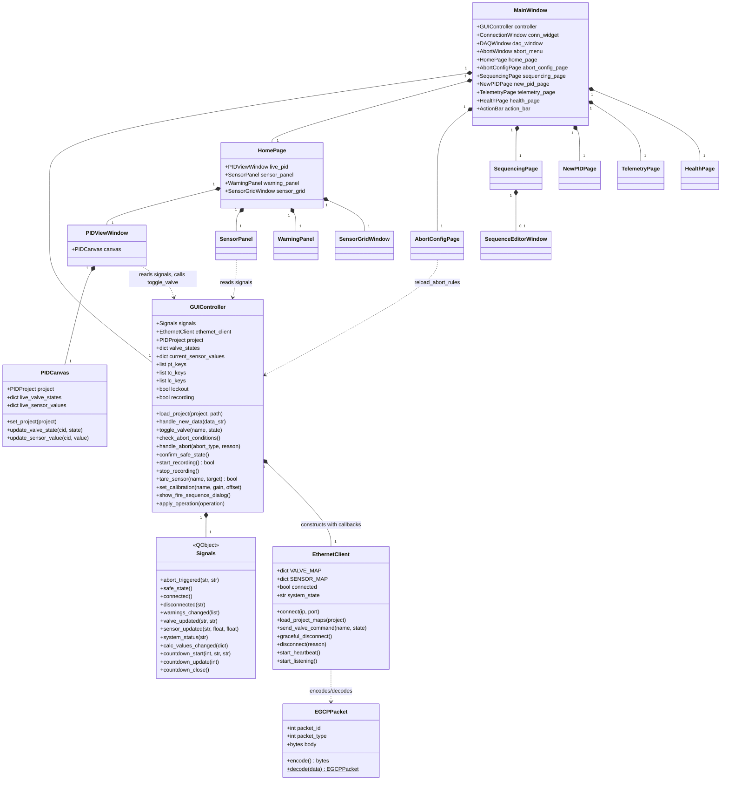
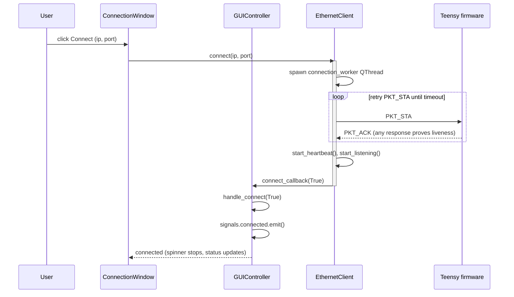
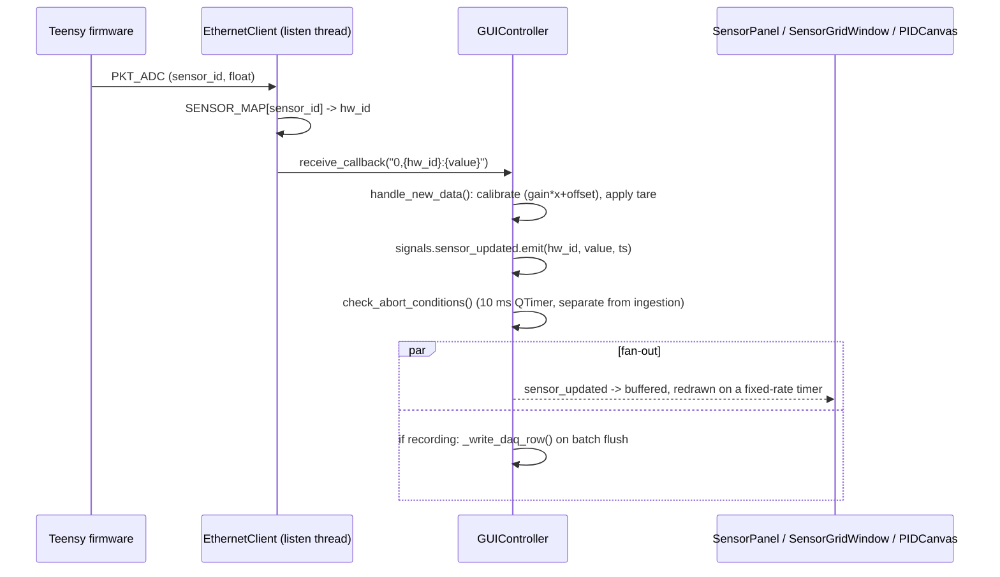
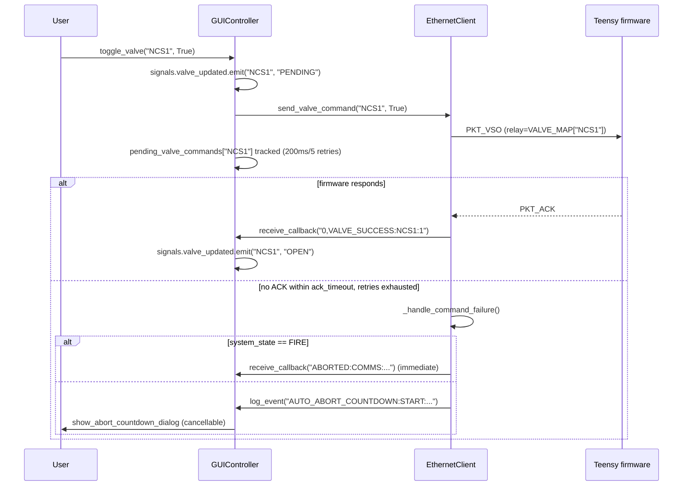

# RED Control System - Architecture & Reference

This document describes the ground-station GUI in `Elysium/REDControlSystem`: what
each module is responsible for, how data and commands flow between the GUI and the
flight/test hardware, the on-wire protocol, and the P&ID project file format.

Diagrams are [Mermaid](https://mermaid.js.org/) — they render natively on GitHub and
in VS Code with the "Markdown Preview Mermaid Support" extension.

> Companion firmware lives in `Elysium/Real_Teensy/E2_Teensy/` (`E2_Teensy.ino` +
> `EGCP.h`). This document treats that firmware as the other half of the system and
> cites it directly wherever the wire protocol or channel mapping is described.

---

## 1. What this system is

The RED Control System is a PyQt5 ground-station application for operating a liquid
rocket engine test stand: it connects to a Teensy 4.1 microcontroller over UDP,
streams live sensor telemetry (pressure transducers, thermocouples, load cells),
issues valve/igniter commands, runs an automated abort/rule engine, drives scripted
fire sequences, and records everything to an `.xlsx` DAQ log. A separate P&ID editor
lets an operator draw the physical plumbing diagram and bind each drawn component to
a firmware channel ID (relay index or ADC channel) — that binding is the single
source of truth the rest of the app is built around.

Entry point: [`GUI_MAIN.py`](../GUI_MAIN.py) constructs a `QApplication` and shows
[`MainWindow`](../GUI_LAYOUT.py).

## 2. Layered architecture



Two invariants fall out of this diagram and are worth internalizing before touching
the code:

- **The firmware's channel IDs are fixed** (`EGCP.h`'s `VALVE_*`/`SENSOR_*`
  constants and `E2_Teensy.ino`'s ADC packet IDs). Everything upstream —
  `EthernetClient.VALVE_MAP`/`SENSOR_MAP`, `GUIController.valve_states`/
  `pt_keys`/`tc_keys`/`lc_keys` — is *rebuilt from the loaded `.red` project* every
  time a project is opened. If a component's `hardware.relay`/`hardware.adc` in the
  project doesn't match what the firmware actually sends, that channel is silently
  dropped (`EthernetClient.load_project_maps` prints a "skipped" list to console but
  the GUI has no other indication).
- **`GUIController` never talks to the socket directly.** `EthernetClient` is
  callback-driven (`receive_callback`, `log_event_callback`, `connect_callback`,
  `disconnect_callback`) and runs its connect/heartbeat/listen loops on separate
  `QThread`s; `GUIController` is the only thing that owns those callbacks, and it
  re-publishes everything as Qt signals so the rest of the UI never touches threads
  directly.

## 3. Module reference

| Module | Responsibility |
|---|---|
| `GUI_MAIN.py` | Application entry point. |
| `GUI_CONTROLLER.py` | `GUIController` + `Signals`: central state, abort/rule engine, DAQ (xlsx) recording, valve command retry/tracking, fire-sequence execution, calculated performance channels (Mdot/Thrust/Isp). |
| `GUI_COMMS.py` | `EGCPPacket` + `EthernetClient`: binary wire protocol, UDP socket lifecycle, heartbeat, ACK/NCK retry, comms-loss auto-abort countdown. |
| `PID_SCHEMA.py` | Dataclasses for the P&ID project file: `Component`, `PipeLine`, `SystemParameters`, `SensorThresholds`, `AbortRule`, `SequenceStep`, `NamedSequence`, `CalcChannel`, and the `PIDProject` container (load/save/`from_dict`). |
| `PROJECT_LOADER.py` | Thin wrapper: discovers `.red` files under `PIDs/`, loads one via `PIDProject.load`, builds a human-readable summary string. |
| `PID_CANVAS.py` | `PIDCanvas` + `Renderer`: the zoomable/pannable P&ID drawing surface (shared by the editor, live view, and sequence editor), including line-pressurization inference and MEOP/MAWP glow. |
| `PID_EDITOR.py` | `PIDEditorWindow`: the P&ID authoring tool (palette, property panel, canvas in interactive mode). |
| `PID_VIEW.py` | `PIDViewWindow`: read-only live P&ID view wired to `GUIController` signals; owns the valve-open/close popup and throttle dialog. |
| `PROJECT_SEQUENCE_EDITOR.py` | `SequenceEditorWindow`: builds/edits named auto-fire sequences (valve states per named step, terminal-count marking). |
| `GUI_LAYOUT.py` | `MainWindow` (top-level shell, tab bar, project selector, stylesheet) plus `HomePage`, `SensorPanel`, `WarningPanel`, `ActionBar`, `TareDialog`, `SequencingPage`, `NewPIDPage`. |
| `GUI_GRAPHS.py` | `SensorGraph` (matplotlib, blitted 10 Hz redraw), `SensorGridWindow` (live value grid + main graph), `MultiGraphWindow` (pop-out multi-graph window), `SensorPickerPopup`. |
| `GUI_HEALTH.py` | `HealthPage`: link/sensor health table (stale/flatline detection) + `SensorCalibrationDialog` (confidence-driven PT calibration wizard). |
| `GUI_TELEMETRY.py` | `TelemetryPage`: post-test DAQ file browser, spreadsheet view, and time-series graph/compare view for recorded `.xlsx` files. |
| `GUI_ABORT_CONFIG.py` | `AbortConfigPage` (per-sensor threshold + logic-rule editor) and `AbortWindow` (the big manual-abort / confirm-safe-state button). |
| `GUI_PERFORMANCE.py` | `PerformanceBar` + `CalcChannelsDialog`: user-defined Mdot/Thrust/Isp formula channels shown in the bottom action bar. |
| `GUI_CONNECT.py` | `ConnectionWindow`: IP/port entry and connect/disconnect button. |
| `GUI_DAQ.py` | `DAQWindow`: recording start/stop, throttling/gimbaling toggle buttons (legacy panel; most of this is now also surfaced via `ActionBar`). |
| `GUI_LOGO.py` | `LogoWindow`: static logo asset display. |

## 4. Data model — `PID_SCHEMA.py`

Everything in a `.red` project file is one of these dataclasses. `PIDProject.load`/
`PIDProject.from_dict` deserialize a project; `PIDProject.save` round-trips it back to
JSON.



`PIDProject.sequence` is a legacy flat list kept only for backward-compatible reads
of older project files; `PIDProject.load`/`from_dict` promote it into a `NamedSequence`
called "Default" the first time such a file is opened, and everything downstream
(`GUIController`, `SequenceEditorWindow`) works against `PIDProject.sequences` /
`active_sequence_id` instead.

`Component.type` is one of the `COMP_*` string constants (`valve`, `throttle_valve`,
`pressure`, `temperature`, `load_cell`, `tank`, `injector`, `regulator`,
`check_valve`, `relief_valve`, `label`, `junction`, `ball_valve`, `psv`, `prv`,
`solenoid`, `globe_valve`, `reducer`, `igniter`, ...). The **hardware binding is the
only thing that matters for wire alignment**: `hardware.relay` for anything
actuated (valve/ball_valve/solenoid/globe_valve/igniter — see §6), `hardware.adc`
for anything sensed (pressure/temperature/load_cell).

## 5. Runtime classes — controller, comms, and UI composition



Every page/window in the UI layer takes `GUIController` as a constructor argument and
does exactly two things with it: connect to `controller.signals.*` for inbound state
changes, and call `controller.*()` methods for outbound actions. No window talks to
`EthernetClient` or the socket directly — that indirection is what keeps the UI
thread-safe (see §2).

## 6. Wire protocol - EGCP

Defined identically on both sides: [`EGCP.h`](../../Real_Teensy/E2_Teensy/EGCP.h) in
C++, `EGCPPacket` in [`GUI_COMMS.py`](../GUI_COMMS.py) in Python. Binary, big-endian,
over UDP.

**Frame layout** — 4-byte header + 0–15 byte body:

```
 31                                   8 7      4 3      0
+---------------------------------------+--------+--------+
|         packet_id (24 bits)           |  type  | length |
+---------------------------------------+--------+--------+
|                  body (0-15 bytes, packed per type)      |
+-----------------------------------------------------------+
```

| Type | Value | Direction | Body |
|---|---|---|---|
| `PKT_ACK` | `0x0` | either | 3 bytes: acked packet_id |
| `PKT_NCK` | `0x1` | either | 3 bytes: nck'd packet_id |
| `PKT_HRT` | `0x2` | GUI → Teensy | empty |
| `PKT_VSO` | `0x3` | GUI → Teensy | 1 byte: valve relay ID (open) |
| `PKT_VSC` | `0x4` | GUI → Teensy | 1 byte: valve relay ID (close) |
| `PKT_GVS` | `0x5` | *unused* | globe-valve step — declared, not implemented either side |
| `PKT_BGP` | `0x6` | *unused* | begin gimbal program — declared, not implemented either side |
| `PKT_HGP` | `0x7` | *unused* | halt gimbal program — declared, not implemented either side |
| `PKT_SFE` | `0x8` | either | enter safe mode (emergency abort) |
| `PKT_ADC` | `0x9` | Teensy → GUI | 1 byte sensor ID + 4-byte big-endian float |
| `PKT_STA` | `0xA` | GUI → Teensy | handshake / connection start |

> **`PKT_GVS`/`PKT_BGP`/`PKT_HGP` are dead protocol.** `GUIController.toggle_gimbaling`
> only flips a local flag and logs it; `PID_VIEW.py`'s throttle dialog calls
> `self.controller.set_throttle(...)`, a method that **does not exist** on
> `GUIController` (the call is wrapped in a `try/except AttributeError` that silently
> swallows the failure). `E2_Teensy.ino`'s main loop only branches on `PKT_STA`,
> `PKT_HRT`, `PKT_VSO`, `PKT_VSC`, and `PKT_SFE` — it has no handler for `PKT_GVS`
> either. Globe-valve throttling and gimbaling are UI-only today; wiring them up is a
> real feature (packet body format, firmware actuation, GUI send path), not a
> mapping fix.

### 6.1 Reliability

Every `PKT_VSO`/`PKT_VSC`/`PKT_SFE` the GUI sends is tracked in
`EthernetClient.pending_acks` (packet_id → (sent_time, packet, retry_count)) and
retried up to `max_retries` (10) every `ack_timeout` (60 ms) inside the heartbeat
loop. If retries are exhausted, `_handle_command_failure` fires:

- If `system_state == "FIRE"`: **immediate** `_trigger_comms_auto_abort` — no
  countdown, because a stuck valve command during an active fire is not something to
  wait out.
- Otherwise: an operator-cancellable countdown starts
  (`AUTO_ABORT_COUNTDOWN:START:...` → `GUIController.show_abort_countdown_dialog`),
  which the operator can cancel via **Confirm Safe State**
  (`GUIController._cancel_abort_countdown` → `confirm_safe_state`).

Separately, `GUIController` runs its own valve-command tracking
(`pending_valve_commands`, `valve_retry_timeout=200ms`, `valve_max_retries=5`,
checked by `check_valve_command_timeouts` on a 100 ms `QTimer`) — this is the
*application-level* retry (re-sending `send_valve_command`) layered on top of the
comms-level ACK retry described above.

### 6.2 Loss-of-heartbeat abort

`EthernetClient.start_heartbeat`'s loop sends a `PKT_HRT` every
`heartbeat_tx_cadence` (10 ms) and checks `heartbeat_last_rx` — updated on *any* valid
received packet, not just heartbeats — against `heartbeat_rx_miss_interval` (100 ms).
If nothing has arrived in that window, it invokes `receive_callback("ABORTED:COMMS:...")`
directly, which `GUIController.handle_new_data` turns into a
`signals.abort_triggered` emission (see §8).

### 6.3 Sequence diagrams

**Connect / handshake:**



**Live sensor telemetry:**



**Valve command with retry:**



**Abort trigger (any source):**

```mermaid
sequenceDiagram
    participant Source as Sensor rule / Logic rule /<br/>Manual button / Comms loss / Remote SFE
    participant GC as GUIController
    participant ETH as EthernetClient
    participant UI as AbortWindow / dialogs

    Source->>GC: signals.abort_triggered.emit(type, reason)
    GC->>GC: handle_abort(): _cancel_sequence()
    GC->>ETH: set_system_state("ABORT")
    GC->>GC: pre_abort_valve_states = valve_states.copy()
    loop every open valve
        GC->>GC: toggle_valve(v, False)
    end
    GC->>UI: QMessageBox.critical("ABORT TRIGGERED", ...)
    GC->>GC: lockout = True
    GC->>GC: log_event("ABORT", "{type}:{reason}")
    UI->>GC: operator clicks Confirm Safe State
    GC->>ETH: cancel_auto_abort_countdown(), set_system_state("SAFE")
    GC->>GC: lockout = False; signals.safe_state.emit()
```

## 7. Channel mapping — keeping P&ID, GUI, and firmware aligned

The firmware's channel IDs are hardcoded constants; the `.red` project's
`hardware.relay` / `hardware.adc` fields are the *only* thing that has to match them.
There is no automatic validation of this today — misalignment fails silently (a
channel is either dropped by `EthernetClient.load_project_maps`, or a valve command
goes to the wrong relay). Current bindings, current firmware constants:

| Firmware constant (`EGCP.h`) | Value | hw_id in `PIDs/Elysium.red` |
|---|---|---|
| `VALVE_NCS1`..`VALVE_NCS6` | `0x01`-`0x06` | `NCS1`..`NCS6` |
| `VALVE_LA_BV1` | `0x10` | `LA-BV1` |
| `VALVE_LA_BV2` | `0x11` | *(none — see below)* |
| `VALVE_GV_1` / `VALVE_GV_2` | `0x20` / `0x21` | `GV-1` / `GV-2` |
| `VALVE_IG1` / `VALVE_IG2` | `0x30` / `0x31` | `IGN_1` / `IGN_2` |
| `VALVE_GIMBAL` | `0x40` | *(none — gimbaling unimplemented, see §6)* |
| `SENSOR_P1`..`SENSOR_P8` | `0x01`-`0x08` | `P1`..`P8` |
| `SENSOR_TC1`..`SENSOR_TC3` | `0x09`-`0x0B` | `TC1`..`TC3` |
| `SENSOR_L1`..`SENSOR_L3` | `0x0C`-`0x0E` | `LC1`..`LC3` |
| *(LC4/LC5 analog bridge, ids 0x0F/0x10 — sent by firmware, no named constant in `EGCP.h`)* | `0x0F` / `0x10` | `LC4` / `LC5` |

Known, deliberate gaps (confirmed with the team, not bugs):

- **`BV_1` / `BV_2`** in the project are manually-operated ball valves included on
  the P&ID purely for visual completeness — they have no relay binding and are not
  commandable from the GUI, by design.
- **`LC6`** has no firmware channel at all (only 5 load-cell channels exist in
  hardware: LC1-3 digital via NAU7802, LC4-5 analog via the ADS7953 bridge) — it's a
  spare placeholder in the project with nothing to bind to.
- **`NCS4`**: `E2_Teensy.ino`'s `get_pin_from_valve_id()` has no case for `0x04` — the
  code comment marks it "a manual switch." The relay ID is still valid so the
  firmware ACKs `PKT_VSO`/`PKT_VSC` for it (the GUI shows success), but no GPIO is
  ever written — it's a physical manual valve, not a bug.
- **`NCS6`**: relay `0x06` is correct and functional, but firmware's own debug
  logging (`get_valve_name()`) calls this same relay `"PA-BV3"` — a hardware-revision
  rename that was never carried back into the GUI's naming. Cosmetic only.

If you add a new sensor or valve to the P&ID, the two things that must both be true
before it will do anything are: (1) `E2_Teensy.ino` actually reads/writes that
physical channel and sends/accepts the matching ID, and (2) the `.red` project's
`hardware.relay`/`hardware.adc` for that component matches that ID exactly. Neither
side warns loudly if the other doesn't cooperate — check `EthernetClient`'s console
output ("Valves/Sensors with no ... binding (skipped)") after loading a project.

## 8. Abort / rule engine

`GUIController.check_abort_conditions()` runs on a 10 ms `QTimer`
(`abort_check_interval`) and evaluates, in order:

1. **System-wide pressure backstop** (`_check_system_pressure_limits`): independent
   of any per-sensor configuration — warns on any PT ≥ `SystemParameters.system_meop`,
   aborts at `0.95 * system_mawp`. Applies across every `pt_keys` entry at once.
2. **Per-sensor threshold rules** (`_sensor_rules`, built by `reload_abort_rules` from
   each sensor `Component.extras["thresholds"]`): three independent bands per sensor
   — `mawp` (hard limit, default action `abort`), `meop` (default `warn`), `relief`
   (default `open_valve`, with hysteresis via `close_valve_below`). Each band
   supports an optional soak time (`soak_ms`) before firing, and a custom `{TOKEN}`
   message template rendered by `render_message_template()`.
3. **Logic/expression rules** (`_logic_rules`, from `project.rules` where
   `condition_type == "expression"`): arbitrary Python-safe boolean expressions over
   `current_sensor_values` (e.g. `"P8 > P7"`), evaluated with
   `eval(expr, {"__builtins__": {}}, current_sensor_values)`.

All three funnel into the same three actions: `abort` (→ `signals.abort_triggered`,
locked out entirely while `lockout=True`), `warn` (→ `signals.warnings_changed`, no
valve change), `open_valve` (auto-opens `target_valve`, auto-recloses once the value
crosses `close_valve_below`).

Abort itself (`handle_abort`) is a hard stop: cancel any running fire sequence, set
comms state to `ABORT`, snapshot then close every valve, set `lockout=True`, and
require an explicit **Confirm Safe State** (`confirm_safe_state`) before anything is
commandable again.

## 9. Known limitations (as of this writing)

- Globe-valve throttling and gimbaling are UI-only — see the callout in §6.
- `GUIController.toggle_abort_mode` was removed as dead code during the last cleanup
  pass; abort behavior is entirely driven by `project.rules` / per-sensor
  `thresholds` now, not by any in-memory "mode" toggle.
- There is no automated check that a `.red` project's `hardware.relay`/`hardware.adc`
  values match the firmware's constants (§7) — this is a manual review step today.
- The top-level `Elysium/README.md` describes an older plaintext
  `"key:value,key:value\r\n"` wire format; the implementation in this directory uses
  the binary EGCP protocol described in §6 instead. Treat that README's "Data
  Formatting" section as historical/aspirational, not descriptive of
  `REDControlSystem`.
